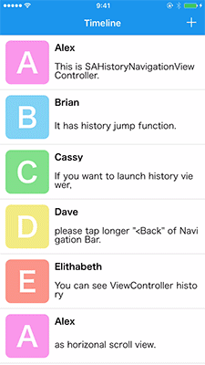
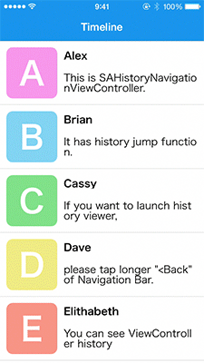

# Awesome Swift UI
A collaborative list of awesome swift UI/UX libraries. Inspired by [cjwirth]'s excellent [Awesome-iOS-UI][awesome-ios-ui].

## Other lists
- Looking for core libraries? _ Check out _ [dkhamsing/awesome-swift]
- Looking for android? _ Check out _ [wasabeef/awesome-android-ui]

## Index
- Animation
- Button
- Calendar
- Dialog
- Effect
- Photo/Video
- Progress
- Refresh
- Table/Collection View
- Tutorial/Onboarding
- Other

### Animation

Name                                                                                                     | License | Sample
-------------------------------------------------------------------------------------------------------- | ------- | --------------------------------------------------------------------------------------------------------------------------------------------------------------------------------------------------------------------------------------
[SAHistoryNavgiationViewController](https://github.com/szk-atmosphere/SAHistoryNavigationViewController) | [MIT]   |   

### Button
### Calendar
### Dialog
### Effect
### Photo/Video
### Progress
### Refresh
### Table/Collection View
### Tutorial/Onboarding
### Other

[cjwirth]: https://github.com/cjwirth
[dkhamsing/awesome-swift]: https://github.com/matteocrippa/awesome-swift#ui
[wasabeef/awesome-android-ui]: https://github.com/wasabeef/awesome-android-ui
[awesome-ios-ui]: https://github.com/cjwirth/awesome-ios-ui
[mit]: http://opensource.org/licenses/MIT
[apache-license-v2]: https://www.apache.org/licenses/LICENSE-2.0
